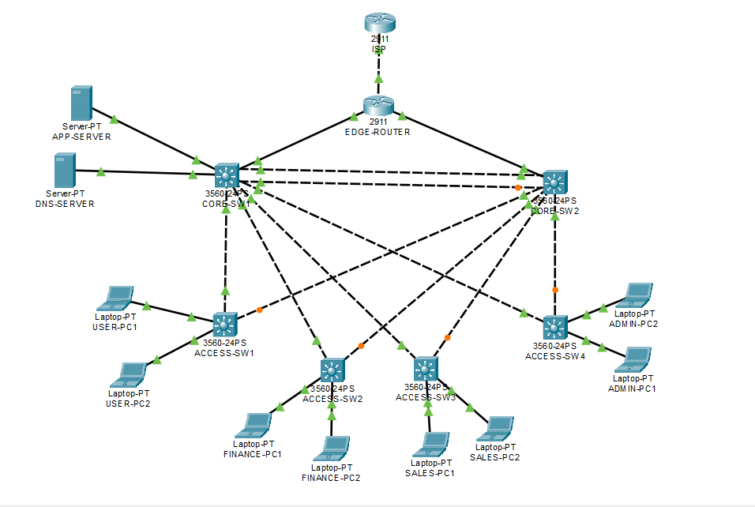

# Enterprise Campus Network Design & Implementation

A multi-VLAN enterprise campus network designed and implemented in Cisco Packet Tracer, focusing on network segmentation, routing, redundancy, network services, access control and secure management.

## Project Overview

This project simulates an enterprise campus network with separate VLANs for users, finance, sales, administration, servers and management.

The network includes redundant core switching, first-hop gateway redundancy, dynamic routing, DHCP, NAT/PAT, ACL-based traffic control and SSH management.

## Technologies

- Cisco Packet Tracer
- Cisco IOS
- VLANs
- 802.1Q
- VTP
- RSTP
- HSRP
- OSPF
- Inter-VLAN Routing
- DHCP
- NAT/PAT
- ACL
- SSH

## VLAN Architecture

| VLAN | Name | Purpose |
|------|------|---------|
| 10 | USERS | User devices |
| 20 | FINANCE | Finance devices |
| 30 | SALES | Sales devices |
| 40 | ADMIN | Administrative devices |
| 50 | SERVERS | Application and DNS servers |
| 99 | MANAGEMENT | Network management |
| 999 | NATIVE | Trunk native VLAN |

## Key Implementation

### Switching

- VLAN segmentation
- 802.1Q trunking
- VTP
- RSTP
- Native VLAN configuration

### Routing

- Inter-VLAN routing
- OSPF
- HSRP gateway redundancy

### Network Services

- DHCP
- NAT/PAT
- Application server
- DNS server

### Security

- VLAN segmentation
- Extended ACL traffic control
- SSH version 2
- Dedicated management VLAN

## Security Validation

VLAN 10 traffic to VLAN 20 was blocked using an ACL while access from VLAN 10 to the server VLAN remained permitted.

## Verification

Evidence screenshots are available in the `verification/` directory.

Configuration files are available in `configurations/`.

The Packet Tracer topology is available in `topology/`.

## Testing

The implementation was tested using:

- VLAN verification
- Trunk verification
- STP verification
- VTP verification
- HSRP verification
- OSPF neighbor verification
- DHCP lease verification
- NAT translation verification
- ACL positive/negative testing
- SSH login testing
- End-to-end connectivity tests